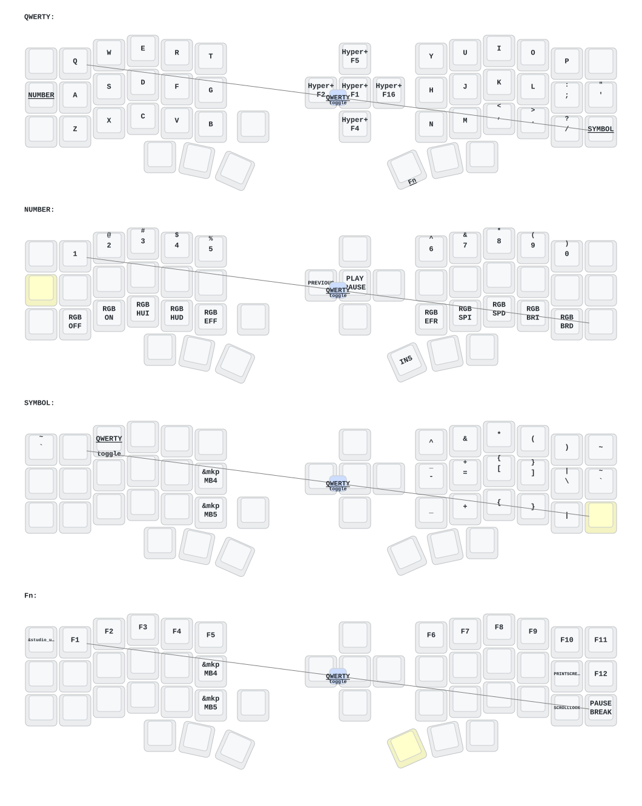

# Keyboard Config

Canonical repository for my keyboard firmware and layouts.

## Active keyboard: MoErgo Go60

Wireless split Go60 running [MoErgo's ZMK fork](https://github.com/moergo-sc/zmk).

- `config/go60.keymap` — keymap, including the Paseo control layer (see [docs/go60-paseo-layer.md](docs/go60-paseo-layer.md))
- `config/go60.conf` / `config/default.nix` — ZMK config and nix build definition
- `scripts/build-go60-local.sh` — local firmware build (podman/docker + nix) producing `go60.uf2`
- `.github/workflows/build-go60.yml` — the same build on GitHub Actions
- `bridge/` — Paseo Deck: AutoHotkey + WSL helper that turns the Paseo layer's F13–F24 keys into agent controls ([bridge/README.md](bridge/README.md))

## Eyelash Corne

The active setup is a wireless **Eyelash Peripherals Corne** running ZMK. This board is not the same as [foostan's Corne](https://github.com/foostan/crkbd) and does not use standard `corne` firmware.

### Edit the keymap

Use [Nick Coutsos' Keymap Editor](https://nickcoutsos.github.io/keymap-editor/) with this repository. The editor-facing files are:

- `config/eyelash_corne.keymap` — active keymap and behaviors
- `config/eyelash_corne.json` — custom physical layout metadata
- `config/eyelash_corne.conf` — ZMK feature configuration

The custom board definitions live under `boards/arm/eyelash_corne/`. Keep the `.keymap` and `.json` filenames aligned with the `eyelash_corne` board identifier so Keymap Editor can discover the layout correctly.

### Build firmware

The build matrix is defined in `build.yaml` and currently produces:

- left-half firmware
- right-half firmware
- a ZMK Studio-enabled left-half build
- settings-reset firmware

Run **Build ZMK firmware** from the repository's Actions tab, then download the firmware artifacts from the completed run. The ZMK and nice-view-gem dependencies are pinned in `config/west.yml`.

### Keymap diagram

The **Draw Keymap** workflow regenerates `keymap-drawer/eyelash_corne.svg` whenever files under `config/` change.

### Current features

- macOS and Windows base layers
- symbol, number/media, and function layers
- mouse movement, scrolling, and mouse buttons
- rotary encoder support
- RGB underglow and backlight
- Nice!View Gem display support
- ZMK Studio build

## Legacy QMK layouts

Historical QMK Configurator exports for the Redox Wireless and Idobo/XD75-era setup are preserved under [`legacy/qmk/`](legacy/qmk/README.md). They are references only and are not part of the active ZMK build.
